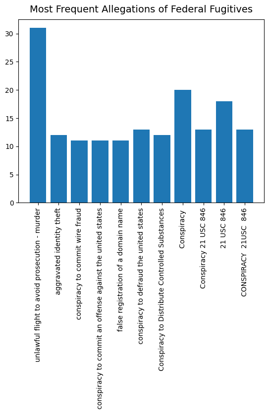
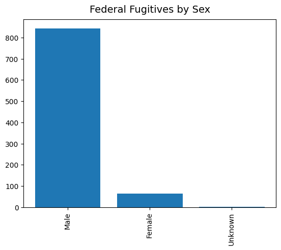
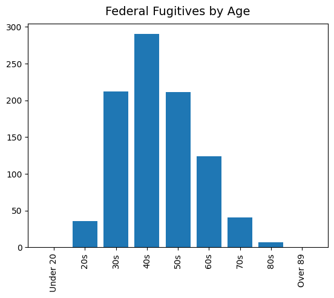
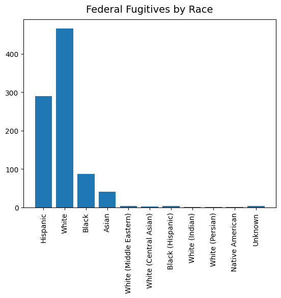
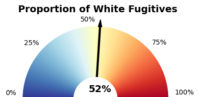
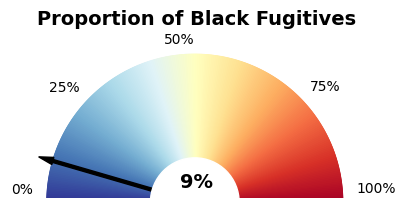
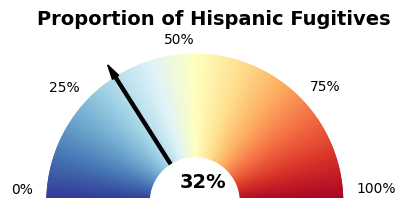
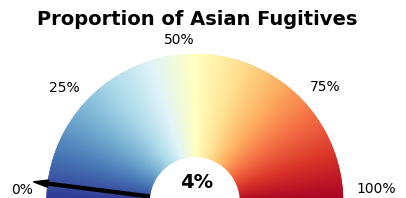

# An Analysis of Fugitives Wanted by the FBI and DEA
The object of this inquiry is to determine what characteristics are most common amongst fugitives wanted by the FBI and DEA and to determine if any demographic groups are over or under-represented in the data.
## Process Order
### Fugitive.py
Fugitive.py is not meant to be run, it is meant to live in the same directory of the forthcoming files, since they will rely on the Fugitive class as a way of binding the attributes of each fugitive. Below is a screenshot of part of the code.

### fbi_fugitive_scrape.py
This program uses requests and BeautifulSoup scrape each fugitive's data from the pages of "https://www.fbi.gov/wanted/fugitives". The program iterates through each page in the general list, scrapes the names and url for each individual fugitive and initializes the fugitive object for each fugitive. Then it proceeds to iterate through each fugitive's URL and add all their data as class attributes. Finally, all the fugitive data is written to a CSV in a tidy manner.

### dea_fugitive_scrap.py
This program functions similarly to the last one, however, using Selenium instead addition to requests and BS4. The DEA will, in my experience, try to block your activity after 10 or so pages using only requests and BS4. I attempted to add browsing headers, which can apparently 'trick' programs looking for scrapers/webcrawlers. Selenium uses a headless (if you so choose) browser, so an additional driver is needed to use the brower of your choice, in my case, Geckcodriver for Firefox. Due to the necessity of using Selenium and the abundance of fugitives, running this program took me significantly longer, as much as 8 to 10 times longer to run than the FBI scraping.

Once all fugitive pages are iterated through, their records are appended to the CSV.
### fugitives_file.csv
The fugitives CSV contains all the information of interest (and a bit extra) for each fugitive.

### fugitives_db.py
This program uses Psycopg2 to interact with PostgreSQL. One function initializes our semi-normalized tables in the database. The next function reads in our fugitive CSV data and utilizes a SQL stored proceedure to import the data to the database.

Note that this program works with my database "testdb" and my password that is attained from user input.

When the file is run, one should press "1" to initialize the tables, then "2" to add the records. Then press "3" to quit.

### fugitive_charts.py
This program creates the analysis charts using Matplotlib. I explain the charts below.

## Analysis
### Fugitive Allegations

### Fugitives by Sex

### Fugitives by Age

### Fugitives by Race

